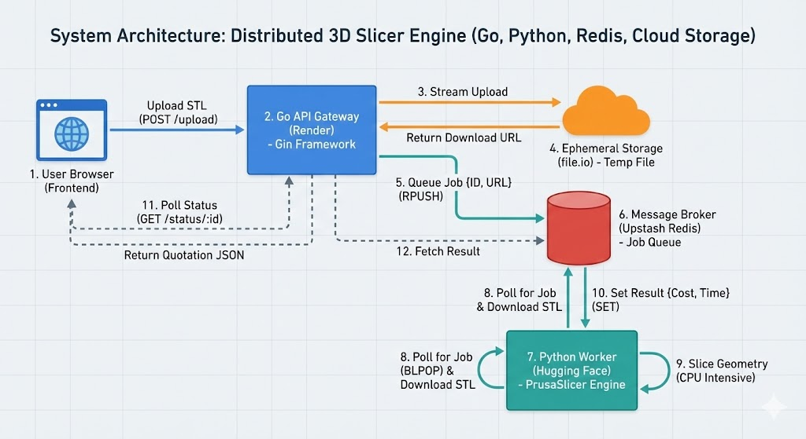

# Distributed 3D Slicer & Quotation Engine


> **A high-throughput, distributed microservices system that automates 3D print pricing by decoupling high-concurrency API handling from CPU-intensive geometric analysis.**

🔴 **Live Demo:** [https://prusaslicer-rpc.onrender.com/](https://prusaslicer-rpc.onrender.com/)

---

## 📖 Project Overview

This system is an automated engine that accepts raw 3D CAD files (STEP/STL), analyzes their geometry, and provides instant manufacturing cost estimates. 

Unlike monolithic slicers, this project uses a **Distributed Worker Pattern**. A lightweight **Go API Gateway** handles incoming traffic and offloads heavy processing to a scalable fleet of **Python Workers** via a **Redis** job queue. This architecture ensures the API remains responsive even under heavy load.

### **Key Technical Achievements**
* **Horizontal Scalability:** Decoupled the worker service to allow dynamic scaling of consumer replicas during traffic spikes.
* **Stateless Architecture:** Implemented a fully stateless worker lifecycle with ephemeral file processing and automated cleanup.
* **100% Decoupling:** Separated IO-bound tasks (Go) from CPU-bound tasks (Python) using an asynchronous producer-consumer pattern.
* **Complex Pipeline Automation:** Integrated **PrusaSlicer** (C++ engine) and **Trimesh** for programmatic mesh validation, auto-orientation, and G-code generation.

---

## 🛠️ System Architecture

The system follows an **Event-Driven Microservices** architecture.



### **Data Flow**
1.  **Ingestion (Go/Gin):** User uploads a file. The API streams it to ephemeral cloud storage and pushes a Job ID to **Redis**.
2.  **Queue (Redis):** Acts as a buffer, smoothing out traffic spikes and ensuring no jobs are dropped if workers are busy.
3.  **Processing (Python):** A worker pulls the job (BLPOP), downloads the file, and runs the geometry pipeline:
    * **Validation:** Checks for non-manifold edges and holes using `trimesh`.
    * **Conversion:** Converts `.STEP` files to `.STL` automatically.
    * **Orientation:** Uses `Tweaker3` to calculate the optimal print orientation for minimal support material.
    * **Slicing:** Runs `PrusaSlicer` CLI to generate G-code and extract accurate print time/mass.
4.  **Result:** Pricing metadata is stored in Redis (TTL 24h) for the frontend to poll.

---

## 🚀 Usage

You can try the [Live Demo](https://prusaslicer-rpc.onrender.com/) or use the JSON API directly.

### **1. Get a Quote (API)**
```bash
curl -X POST [https://prusaslicer-rpc.onrender.com/quote](https://prusaslicer-rpc.onrender.com/quote) \
  -H "Content-Type: application/json" \
  -d '{
    "download_url": "[https://example.com/file.stl](https://example.com/file.stl)",
    "material": "PLA",
    "infill": 15
  }'

```

### **2. Poll Status**

```bash
curl [https://prusaslicer-rpc.onrender.com/status/](https://prusaslicer-rpc.onrender.com/status/){job_id}

```

**Response:**

```json
{
  "status": "completed",
  "data": {
    "summary": {
      "total_cost": 12.50,
      "print_time": "4h 15m",
      "material": "PLA",
      "complexity": "medium"
    }
  }
}

```

---

## 🔧 Engineering Deep Dive

### **Why Go for the API?**

I chose Go for the Gateway because of its efficient concurrency model (Goroutines). It handles thousands of idle connections (long-polling clients) with a minimal memory footprint compared to a Python/Flask equivalent.

### **Why Python for the Worker?**

Python is the industry standard for scientific computing. It allows seamless integration with `numpy` for matrix transformations and provides Python bindings for the C++ `PrusaSlicer` and `Tweaker3` binaries.

### **Handling "Zombie" Processes**

One challenge was that the Slicer CLI could hang on corrupted meshes. I implemented a strict **timeout wrapper** around the `subprocess` calls in Python. If a slice takes longer than 5 minutes, the worker kills the process, flags the job as failed, and cleans up the ephemeral files to prevent disk exhaustion.

---

## 💻 Local Development

Run the entire stack locally using Docker Compose.

```bash
# 1. Clone the repo
git clone [https://github.com/zenkang/PrusaSlicer-RPC.git](https://github.com/zenkang/PrusaSlicer-RPC.git)

# 2. Build and Start
docker-compose up --build

```

The services will be available at:

* **Frontend/API:** `http://localhost:8000`
* **Redis:** `http://localhost:6379`

---

## 📬 Contact

**Zen Kang** [LinkedIn](https://www.google.com/search?q=https://linkedin.com/in/zen-kang) | [Email](mailto:thyme3dprint@gmail.com)
